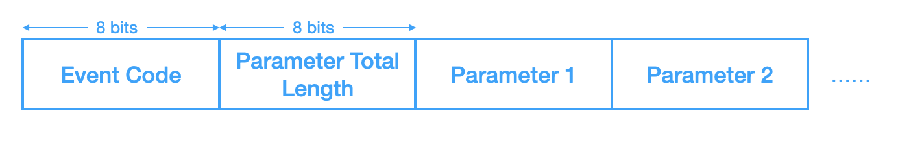

#### 蓝牙概述

蓝牙技术起源于爱立信在1994年提出的方案，旨在解决移动电话和其他配件之间进行低功耗、低成本的无线通信连接的方法。


- 第一代蓝牙主要是指90年代的V1.0～V1.2版本，是关于段距离通信的早期探索，此时还存在许多问题，应用不是特别广泛
- 第二代蓝牙主要是00年中V2.0～V2.1版本，新增了EDR(Enhanced Data Rate)技术提高传输速率，以及体验及安全
- 第三代蓝牙主要是00年末V3.0版本，新增了802.11 WiFi协议，引入了AMP(Generic Alternate MAC/PHY)交替射频技术，极大的提高了传输速率并降低功耗
- 第四代蓝牙是10年以来的V4.0～V4.2版本，主推LE(Low Energy)低功耗，大约仅消耗十分之一，将三种规格，包括经典蓝牙、高速蓝牙、和蓝牙低功耗，集中在一起形成一套综合协议规范
- 第五代蓝牙是16年开始提出的V5.0版本，主要是为了支持物联网，在功耗、传输速率、有效传输距离、数据包容量方面都做了极大的提升

下面的分析都是基于V4.1版本，方便入门，可以理解很多核心协议的设计思想


#### 蓝牙技术分类

蓝牙技术包含蓝牙发展过程中的两套技术，但是这两套原理和实现都不一样，也无法实现互通

- Basic Rate（BR）/AMP

  最初的蓝牙技术，包括**可选的**EDR（Enhanced Data Rate）技术和**交替使用的**MAC层和PHY层扩展 AMP（Alternate MAC and PHY layer extension）【优化传输速度的过程】

  解释：蓝牙诞生之初使用的BR技术，传输速率很低，随着发展而变得无法支持，所以引入了EDR，这时还没有修改软硬件架构，但是之后又落伍了，所以直接引入了WiFi的底层协议，也就是MAC/PHY扩展，但这部分的实现就无法直接更替，所以BR/EDR只能与AMP交替使用

- Low Energy（LE）

  蓝牙低功耗，则不关心传输速率，而是从降低功耗的角度实现的另一套技术，跟前面的协议没有丝毫关系


#### 蓝牙架构


蓝牙协议将蓝牙整体分成了两层架构，底层是核心协议，描述了蓝牙核心技术的基础和规范，应用层协议则基于具体需求，使用核心协议提供的机制，实现不同的功能策略

核心协议包含两部分，Host和Controller，这两部分在不同的蓝牙协议版本中略有区别，但大致上是，Controller完成硬件侧的规范制订，包括信号调制解调，会抽象出用于通信的逻辑链路，可能存在一个或多个，如LE Controller、BR/EDR Controller；Host则在逻辑链路的基础上完成更友好的封装，屏蔽掉技术细节，方便应用层对数据的使用


#### 蓝牙协议

蓝牙协议也采用层次结构，自下而上依次为物理层、逻辑层、L2CAP层和应用层


- 应用层（App Layer）：为不同场景定义规范，提出Profile(一项服务)的概念，实现各种应用功能

- L2CAP（Logical Link Control and Adaptation Protocol Layer）：逻辑链路控制和适配协议，负责管理逻辑链路，使得不同应用可共享一个逻辑链路，类似端口的实现
  - 在逻辑链路的基础上，抽象出与具体技术无关的数据传输信道，如单/广播，然后对上以L2CAP channel endpoints的概念，为不同应用程序提供独立的传输通道
- 逻辑层（Logical Layer）：提供设备对象之间逻辑传输，在物理层的基础上，建立逻辑信道，主要基于传输类型来划分，包括控制类传输（负责底层物理链路的管理）、用户类传输（负责用户数据传输）和其他特殊类型的传输
  - 不同的逻辑信道（Logical Link）会在下层对应Logical Transport，实现流控、应答、重传等机制

- 物理层（Physical Layer）：负责提供数据传输的物理通道

  - 物理链路（Physical Link）：对物理信道的进一步封装

  - 物理信道（Physical channel）：三种蓝牙技术都使用相同的频段和频率范围，但是具体实现都不一样
    - BR/EDR频段分成了79个channel，每个占1M带宽；采用跳频技术（Hopping），即物理信道随机占用某一channel；定义了五种物理信道，每次只能在一种物理信道上通信，采用时分方式
      - Inquiry Scan Physical Channel：用于发现操作，即搜索/被搜索
      - Page Scan Physical Channel：用于连接操作，即连接/被连接
      - Basic Piconet Physical Channel：用于连接状态下通信，使用79个跳频点
      - Adapted Piconet Physical Channel：用于连接状态下通信，使用较少RF跳频点
      - Synchronization Scan Channel：用于无连接的广播通信
    - AMP直接使用WIFI的物理层规范，只有一个物理信道，用于已连接设备之间的高速数据通信
    - LE频段分成了40个channel，每个占2M带宽；有两种物理信道，每次只能在一种物理信道上通信，采用时分方式
      - Advertisement Broadcast Channel：用于设备间无连接广播通信，包括发现/连接操作
      - Piconet channel：用于连接状态下通信


#### BLE协议栈

实现一个BLE应用，需要一个支持BLE射频的芯片，然后基于一个与芯片配套的协议栈，开发蓝牙应用。

协议栈的作用就是软件和硬件之间的桥梁，对应用数据进行封包然后生成可以通过射频发送的空中数据包及其逆向过程。


- Physical Layer（PHY）

  - 蓝牙通信系统的物理层，是免费ISM频段，整个频带分成40份，每份带宽2MHz；此外还定义了RF收发相关的特性，如发射功率、调制解调方式等

- Link Layer（LL）

  - 解决在有限物理信道上传输远多实际信道数量的数据，即信道共享，然后为通信实体创建看似独享的逻辑信道，以及解决传输过程中的校验、重传等问题

  - LL中的信道设计：BLE系统基于通信场景，在40个物理信道中选取三个作为广播信道，处理数据量小、发送不频繁、时延不敏感的场景，存在的问题就是不可靠、效率低、不安全；另外的场景则在剩下的37个信道中选取一个为双方建立单独信道，并且为了抗干扰采用跳频技术

  - 为此，LL为通信双方实体定义了以下状态及切换条件

    

    - Standby：初始状态，不收发数据，接受上层协议命令与其他状态切换
    - Advertising：通过广播发送数据的状态，建立连接后可进入Connection
    - Scanning：接收广播的数据的状态
    - Initiating：特殊的接收状态，类似Scanning，接收Advertiser广播的连接数据，建立连接后进入Connection
    - Connection：建立连接后拥有单独的通道

  - 这里会使用空中接口协议（Air Interface Protocol，AIP）来负责实体之间的数据交换和状态切换

- Host Controller Interface（HCI）

  - 定义Host和Contorller之间的通信协议，如两个芯片之间的串口

- L2CAP

  - 逻辑控制和适配协议的工作就是实现逻辑信道的多路复用（multiplexing），对上层数据进行分割和重组，以及后续的流控、错误控制和重传等
  - 多路复用思想：将要发送的数据分割成一个个数据包（Packet Data Unit，PDU），添加包含特定ID的头部，接收方解析头部ID进行重组
  - 多路复用实现
    - 基于连接：L2CAP会为每个逻辑信道分配一个编号（Channel ID，CID），有些CID会有固定用途
    - 基于协议（略）

- Attribute Protocol（ATT）

  - **属性协议**主要是针对物联网场景，核心思想就是将采集的信息或控制的命令**以属性的形式抽象出来**，提供接口供远端设备读写
  - 采用C/S形式，信息提供方为ATT Server，如传感器，访问方为ATT Client
  - 为每个Attribute定义了三个属性
    - Type，即Attribute的类型，使用UUID区分
    - Handle，服务端用来唯一标识Attribute的16-bit数值
    - Value，Attribute的值
  - 为每个Attribute定义了一系列权限，方便服务端控制客户端的行为，包括访问/加密/认证/授权
  - 对于不同的Attribute，客户端对服务端的访问方式也不一样，包括Find/Read/Write
  - 传输过程是在L2CAP的基础上，使用基于通道的多路复用，CID为`0x0004`

- Generic Attribute Profile（GATT）

  - **通用属性配置文件**，Attribute只是将信息（或者说通信数据）做一下抽象，但是真正对抽象的信息做分类管理则是GATT来完成，形成profile的概念（解决了很多无线协议的兼容问题），profile可以理解成应用场景或者使用方式

  - GATT提供了这样一种通用的、信息存储与共享的profile framework，实现BLE双向通信

  - GATT的层次结构

    

  - Profile位于最顶层，不是真正存在的配置文件，而是一个或多个场景相关的service的抽象集合

    Service（服务）是一种行为的抽象，具有唯一标识UUID，每个service包含一个或多个Characteristic，也可以通过include的方式包含其他service

    Characteristic（特征）可以理解成一个属性，是真正与设备通信相关的，数据发送和接收的最基本单位，通过对特征的读写实现蓝牙双向通信，它由一个Propertities（定义Value的使用规范和Descriptor的访问规范）、一个Value（特征的实际取值）和一个或多个Descriptor（Value相关的描述信息）组成，每个特征也具有自己的唯一标识，但是有三种形式：

    - 16-bit是官方认证，收费，Bluetooth_Base_UUID 为 `00000000-0000-1000-8000-00805F9B34FB`

    - 16-bit转128-bit，格式为 `0000xxxx-0000-1000-8000-00805F9B34FB`
    - 32-bit转128-bit，格式为 `xxxxxxxx-0000-1000-8000-00805F9B34FB`

  - 事实上，目前几乎所有的BLE应用都基于GATT实现通信

  - GATT通信基于C/S模型，外围设备作为Server端，维护ATT结构及产出数据，中心设备作为client端，请求连接获取数据

  - GATT连接对外围设备是独占的，即一个外围设备同时与一个中心设备建立连接，一个中心设备可同时与多个外围设备建立连接

- Security Manager（SM）

  - **安全管理协议**主要负责BLE通信过程中安全相关的内容，包括认证、加密这些过程

- Generic Access Profile（GAP）

  - **通用访问配置文件**，定义了蓝牙设备的通用的访问功能，与GATT的数据通信过程对应，处理**无连接**及**连接建立**过程的通信，也就是为广播、扫描、发起连接这些过程定义统一规范
  - 定义了用户接口的基本参数，包括蓝牙地址、名称、pincode、class等概念
  - 定义了设备的角色：
    - Broadcaster Role：正在发送advertising events的设备
    - Observer Role：正在接收advertising events的设备
    - Peripheral Role：接受Link Layer连接的设备（对应Link Layer的slave角色）
    - Central Role，发起Link Layer连接的设备（对应Link Layer的master角色）
  - 定义了通信的过程和操作模式：
    - Broadcast mode and observation procedure：实现单向的、无连接的通信
    - Discovery modes and procedures：实现蓝牙设备的发现操作
    - Connection modes and procedures：实现蓝牙设备的连接操作
    - Bonding modes and procedures：实现蓝牙设备的配对操作


#### BLE的广播

##### 使用场景

1. 单向、无连接的数据通信，发送者使用广播信道发送数据，接受者扫描接收数据
2. 连接建立阶段

##### 协议层次

- GAP：以应用程序角度进行功能封装，提供一套统一的、通用的广播规范
- HCI：将LL提供的功能抽象成Command/Events的形式，供上层使用
- LL：负责广播通信相关功能的定义和实现，包括信道选择、链路状态定义、PDU定义、设备过滤机制等

##### LL

- 信道选择。BLE将蓝牙频段分成了40个物理信道，综合考虑（抗干扰等）后将其中三个作为广播信道，频段为0/12/39，编号是37-39

- 链路状态。参与广播的BLE设备，总是处于这三种状态之一

  - Advertising：广播状态，周期性地广播，数据发送方
  - Scanning：扫描状态，扫描并接受广播数据，数据接收方
  - Initiating：初始化状态，扫描到可连接的广播时，发起连接请求，连接发起方

- PDU（Packet Data Unit）格式

  

  - Type是指PDU的类型，如不同的状态下也有不同的消息类型，TxAdd和RxAdd都是地址类型flag，针对不同的type有不同的含义，RFU都是保留字段，Length标明payload的长度

- Payload内容

  | State       | Type            | Descriptions                                                 | Payload     | length | Descriptions                  |
  | :---------- | :-------------- | :----------------------------------------------------------- | :---------- | :----- | :---------------------------- |
  | Advertising | ADV_IND         | 常规广播，可连接可扫描                                       | AdvA        | 6      | address of broadcaster        |
  |             |                 | 【后续建立点对点连接，监听CONNECT_REQ请求】                  | AdvData     | 0~31   | Broadcast data                |
  |             | ADV_NONCONN_IND | 同ADV_IND，不可连接不可扫描                                  | AdvA        | 6      | address of broadcaster        |
  |             |                 | 【用于定时传输简单数据】                                     | AdvData     | 0~31   | Broadcast data                |
  |             | ADV_SCAN_IND    | 同ADV_IND，不可连接可扫描                                    | AdvA        | 6      | address of broadcaster        |
  |             |                 | 【用于传输额外数据，监听SCAN_REQ请求】                       | AdvData     | 0~31   | Broadcast data                |
  |             | ADV_DIRECT_IND  | 点对点连接，已知双方蓝牙地址，无广播数据，可被指定设备连接不可扫描 | AdvA        | 6      | address of broadcaster        |
  |             |                 | 【快速建立连接，不关心广播数据，监听CONNECT_REQ请求】        | InitA       | 6      | address of receiver/initiater |
  | Scanning    | SCAN_REQ        | 接收ADV_IND/ADV_SCAN_IND后，请求更多信息                     | ScanA       | 6      | address of scanne r           |
  |             |                 | 【接收广播数据后请求更多信息】                               | AdvA        | 6      | address of broadcaster        |
  |             | SCAN_RSP        | SCAN_REQ的响应，返回更多信息                                 | AdvA        | 6      | address of broadcaster        |
  |             |                 |                                                              | ScanRspData | 0~31   | response data                 |
  | Initiating  | CONNECT_REQ     | 接收ADV_IND/ADV_DIRECT_IND后，请求建立连接                   | InitA       | 6      | address of receiver/initiater |
  |             |                 | 【请求建立连接】                                             | AdvA        | 6      | address of broadcaster        |
  |             |                 |                                                              | LLData      | 22     | parameters of connection      |

- BLE设备地址类型

  - Public Device Address：IEEE分配，24-bit的company_id+24-bit的company_assigned，类似MAC
  - Random Device Address：随机生成，解决费用和维护、设备身份绑定的问题
    - Static Device Address：上电生成，46-bit的random+11，断电后可变
    - Private Device Address：进一步提供定时更新和地址加密提高可靠行和安全性
      - Non-resolvable Private Address：按周期定时更新，46-bit的random+00
      - Resolvable Private Address：通过随机数和IRK（Identity Resolving Key）生成，24-bit的hash+22-bit的random+10

##### HCI

- 将Link Layer提供的功能封装成Command/Event组

- Command格式

  

  OCF（Opcode Command Field）表示特定的HCI命令，OGF（Opcode Group Field）表示该HCI命令所属组别，他们共同组成16位操作码；Parameter Total Length表示所有参数总长度

  所有BLE相关的HCI Command的OGF都是`0x08`

- Event格式

  

- 这些Command/Event包括广播、扫描、连接建立的相关操作，这些都可以通过hcitool命令进行测试

##### GAP

- 会从应用程序角度对各种状态和操作再一次进行封装，包括设备角色，通信的模式和操作的定义

- 与GAP广播通信相关的是广播和发现模式

  - Broadcast mode and observation procedure，广播模式及对应的解析过程，对应状态下的角色双方就是Broadcaster和Observer
  - Discovery modes and procedures，发现模式及对应的发现过程，对应的角色就是Peripheral和Central

- 广播数据格式

  

  - 广播/扫描应答数据，包含有意义部分和无意义部分（补齐为0），有意义部分是由一个个广播块（AD Structure）组成，每个广播块包含1字节长度（指示数据部分长度）和剩下的数据部分，数据部分又分为数据类型和数据内容，数据类型会指示真实Data部分的内容，例如`0x01`表示Data内容是描述设备物理连接状态，再例如`0x08`表示Data内容是设备名称，更多可以参考[generic-access-profile](https://www.bluetooth.com/specifications/assigned-numbers/generic-access-profile/)

  - 举个广播数据的例子

    ```shell
    02 01 06 03 03 aa fe 17 16 aa fe 00 -10 00 01 02 03 04 05 06 07 08 09 0a 0b 0e 0f 00 00 00 00
    ```

    `02 01 06`是一个AD Structure，数据部分长度为2字节，类型是`0x01`，描述设备物理连接状态，数据部分`0x06`，1字节8bit，每bit都是一个标志位（[预留]|[预留]|[预留]|[同时支持BLE和BR/EDR（Host）]|[同时支持BLE和BR/EDR（Controller）]|[不支持BR/EDR]|[普通发现模式]|[有限发现模式]），那么这个广播就是普通发现模式，不支持BR/EDR

    `03 03 aa fe`是第二个AD Structure，数据部分长度为3字节，类型是`0x03`，表示16-bits的Service UUID

    `17 16 aa fe 00 -10 00 01 02 03 04 05 06 07 08 09 0a 0b 0e 0f 00 00 00 00`是最后一个AD Structure，数据部分长度为`0x17`即23字节，类型是`0x16`，表示服务数据

| AD Type | Description      | AD Data                                                      |
| :------ | :--------------- | :----------------------------------------------------------- |
| 0x01    | 设备物理连接状态 | 1字节8bit，每个bit都是一个标志位 [预留]\|[预留]\|[预留]\|[同时支持BLE和BR/EDR（Host）]\|[同时支持BLE和BR/EDR（Controller）]\|[不支持BR/EDR]\|[普通发现模式]\|[有限发现模式] |
| 0x02    | UUID             | 非完整的16-bit UUID                                          |
| 0x03    | UUID             | 完整的16-bit UUID                                            |
| 0x04    | UUID             | 非完整的32-bit UUID                                          |
| 0x05    | UUID             | 完整的32-bit UUID                                            |
| 0x06    | UUID             | 非完整的128-bit UUID                                         |
| 0x07    | UUID             | 完整的128-bit UUID                                           |
| 0x08    | 设备名称         | 缩写设备名称                                                 |
| 0x09    | 设备名称         | 完整设备名称                                                 |
| 0x0a    | TX Power Level   | TX Power Level                                               |
| 0xff    | 厂商数据         | [厂商ID]\|[厂商自定义数据]                                   |


#### BLE的连接

经典蓝牙中保持连接非常耗费资源，但是每次连接建立效率又非常低，为了优化体验，BLE简化了连接过程（毫秒级），极大的降低了面向连接通信的代价

蓝牙通信系统中，对于连接的定义是：在约定的时间段内，双方都到一个指定的物理Channel上通信。

##### LL

- 角色定义。BLE为处于连接状态的两个设备定义了两个角色，Master和Slave。Master作为连接发起方，定义和连接相关的参数，Slave是连接的接收方，请求连接参数

- PDU（Packet Data Unit）格式

  

  面向连接的通信使用特定的PDU，称为Data channel PDU

  LLID指示Data Channel传输的PDU类型，传输数据是LL Data PDU，传输控制信息是LL Control PDU，NESN（Next Expected Sequence Number）和SN（Sequence Number）用于数据传输过程中的应答和流控，MD（More Data）用于关闭连接，RFU是预留位，Length指示有效数据长度，包括Payload和MIC

  | LLID | type           | Description                                                  |
  | ---- | -------------- | ------------------------------------------------------------ |
  | 01b  | LL Data PDU    | 空包或未传输完成的消息（被拆包）                             |
  | 10b  | LL Data PDU    | （不需拆包）完整消息或第一个包                               |
  | 11b  | LL Control PDU | 用于控制、管理LL连接的数据包，此时Payload为1字节Opcode和剩余的控制数据 |

- 建立连接
  1. 可连接状态的设备（Advertiser）按照一定周期广播可连接数据包
  2. 主动连接的设备（Initiator）收到广播包后回应一个连接请求（约定时间点、物理信道等）
  3. Initiator发送完毕后进入连接状态，成为Master
  4. Advertiser接收到连接请求后也进入连接状态，成为Slave
  5. 双方按照参数约定，定时切换到某一物理信道，开始依次收发数据，直至连接断开

##### HCI

- 封装Link Layer的功能，主要包括连接的建立、关闭、参数设置和管理，以及数据封装和转发

##### GAP

- 定义设备具有的能力和操作


#### BLE安全机制

##### White List

白名单就是一组蓝牙地址列表，通过设置白名单可以允许扫描、连接特定的蓝牙设备，以及被扫描、连接

##### LL Privacy

在白名单的基础上将设备地址进行加密，转变成Resolvable Private addresses

- 本地Resolving List需要保存每一对BLE设备的key/address信息，格式为：Local IRK|Peer IRK|Peer Device Identity Address|Address Type
- LL Privacy机制在Controller中完成，即加解密操作对HCI上层是透明的

##### LL Encryption

数据发送和接收过程进行加解密

- 加解密操作在Link Layer完成
- Host会保存至少1280bit的LTK（根密钥），启动加密传输时，LL会首先协商出一个128-bit的随机数SDK（Session Key Diversifier）和64-bit的iv，经过Encryption Engine和LTK生成此次通信的会话密钥SessionKey

##### SecurityManager

为BLE设备提供加密连接相关的key，包含以下规范：

- 定义了配对（Pairing）的相关概念及过程
- 定义了密码工具箱，包含配对、加密所需的各种算法
- 定义了安全管理协议（Security Manager Protocol，SMP），实现配对、密码传输等操作

SMP规范中，配对的定义是，Master和Slave通过协商确定用于加密通信的key的过程，包含三个阶段：

- 阶段一、Pairing Feature Exchange，交换双方配对相关的设置，如配对方法、鉴权方式等
  
  - 鉴权方式可以采用交换额外的信息（Out of band，OOB），或者弹窗引入人来判定，称为MITM鉴权，还有输入配对码进行对比（Passkey Entry/Numeric Comparison），或者不鉴权（Just Work）
  
- 阶段二、通过SMP协议进行配对操作，有两种配对方案，LE Legacy Pairing和LE Secure Connections

- 阶段三、协商好密钥key，建立加密连接，传输密钥信息（可选）

  


#### Android中的BLE应用

BLE，蓝牙低功耗（极低的运行和待机功耗）

Android 4.3（API 18） 开始引入 BLE ，即蓝牙4.0

Android 4.3 的 BLE 只支持 Central Role（中心设备，扫描并连接外围设备）

Android 5.0 开始同时支持 Central Role 和 Peripheral Role（外围设备，向外广播发送数据）

##### 1、权限

```xml
<!--蓝牙权限-->
<uses-permission android:name="android.permission.BLUETOOTH"/>
<!--蓝牙相关操作设置权限-->
<uses-permission android:name="android.permission.BLUETOOTH_ADMIN"/>
<!--位置权限，扫描时需要，Android 9-需要模糊定位，Android 10开始需要精确定位-->
<uses-permission android:name="android.permission.ACCESS_COARSE_LOCATION"/>
<uses-permission android:name="android.permission.ACCESS_FINE_LOCATION"/>
<!--声明使用BLE硬件特性，仅系统支持时可安装-->
<uses-feature android:name="android.hardware.bluetooth_le" android:required="true" />
```

##### 2、开启/关闭蓝牙

```java
// 判断支持蓝牙功能
if (getPackageManager().hasSystemFeature(PackageManager.FEATURE_BLUETOOTH_LE)) {
    // 获取蓝牙管理服务
    BluetoothManager bluetoothManager = (BluetoothManager) getSystemService(Context.BLUETOOTH_SERVICE);
    // 获取蓝牙适配器
    BluetoothAdapter bluetoothAdapter = bluetoothManager.getAdapter();
    if (bluetoothAdapter != null) {
        // 判断蓝牙是否开启
        if (bluetoothAdapter.isEnabled()) {
            // 关闭蓝牙
            bluetoothAdapter.disable();
        } else {
            // 1、静默开启蓝牙
            bluetoothAdapter.enable();
            // 2、显式请求开启蓝牙
            Intent intent = new Intent(BluetoothAdapter.ACTION_REQUEST_ENABLE);
            startActivityForResult(intent, REQUEST_BLUETOOTH_ENABLE);
        }
    }
}
```

##### 3、扫描与监听

```java
if (getPackageManager().hasSystemFeature(PackageManager.FEATURE_BLUETOOTH_LE)) {
    // 获取蓝牙管理服务
    BluetoothManager bluetoothManager = (BluetoothManager) getSystemService(Context.BLUETOOTH_SERVICE);
    // 获取蓝牙适配器
    BluetoothAdapter bluetoothAdapter = bluetoothManager.getAdapter();
    if (bluetoothAdapter != null) {
        // 判断蓝牙是否开启
        if (bluetoothAdapter.isEnabled()) {
          	// 获取扫描器实例
            BluetoothLeScanner bluetoothLeScanner = bluetoothAdapter.getBluetoothLeScanner();
            boolean isScanning = false;
            if (bluetoothLeScanner != null) {
                if (isScanning) {
                    // 停止扫描
                    isScanning = false;
                    bluetoothLeScanner.stopScan(scanCallback);
                } else {
                  	// 开始扫描
                    isScanning = true;
                    bluetoothLeScanner.startScan(scanCallback);
                }
            }
        }
    }
}
```

Android 8 开始提供一个后台持续扫描的API，应用杀死后也可以继续扫描，直到关闭蓝牙【待验证】

```java
public int startScan (List<ScanFilter> filters, ScanSettings settings, PendingIntent callbackIntent);

// 设置拦截器和扫描选项
bluetoothLeScanner.startScan(scanFilters, scanSettings, scanCallback);
```

初始化扫描过滤器

```java
scanFilters = new ArrayList<>();
ScanFilter scanFilter = new ScanFilter.Builder()
  .setDeviceName("lalala")
  .setServiceUuid(new ParcelUuid(UUID.randomUUID()))
  .build();
scanFilters.add(scanFilter);
```

初始化扫描设置

```java
scanSettings = new ScanSettings.Builder()
  // 设置扫描模式
  .setScanMode(ScanSettings.SCAN_MODE_BALANCED)
  // 设置回调类型  
  .setCallbackType(ScanSettings.CALLBACK_TYPE_ALL_MATCHES)
  // 设置配对模式
  .setMatchMode(ScanSettings.MATCH_MODE_STICKY)
  // 设置报告延迟
  .setReportDelay(0)
  .build();
```

两个类都是通过 Builder 构造，提供系列函数用于参数设置，如 `setDeviceName()`、`setScanMode()`、`setMatchMode()` 等

##### 4、扫描回调

```java
scanCallback = new ScanCallback {
    @Override
    public void onScanResult(int callbackType, ScanResult result) {
        super.onScanResult(callbackType, result);
    }

    @Override
    public void onScanFailed(int errorCode) {
        super.onScanFailed(errorCode);
    }

    @Override
    public void onBatchScanResults(List<ScanResult> results) {
        super.onBatchScanResults(results);
    }
}
```

其中 `onBatchScanResults()` 是批量返回扫描结果。可通过下面的接口判断蓝牙芯片是否支持批处理

```java
Bluetoothadapter.isOffloadedScanBatchingSupported();
```

注意 `onScanResult()` 和 `onBatchScanResults()` 是互斥的，`ScanSettings ` 中 `setReportDelay()` 设置为0（默认）则通过 `onScanResult()` 返回扫描结果，否则开启批处理扫描模式，并触发 `onBatchScanResults()` 回调。

##### 5、广播数据解析

扫描成功会返回 ScanResult 广播数据类，然后进一步解析

```java
// 返回远程设备类
BluetoothDevice device = scanResult.getDevice();
// 返回扫描记录，包含广播和扫描响应
ScanRecord scanRecord = scanResult.getScanRecord();
// 返回信号强度，[-127, 126]
int rssi = scanResult.getRssi()
```

BluetoothDevice 是设备信息类，常用的方法有

```java
// 获取硬件地址
String address = device.getAddress();
// 获取蓝牙名称
String name = device.getName();
// 获取设备类型，如DEVICE_TYPE_CLASSIC、DEVICE_TYPE_LE、DEVICE_TYPE_DUAL、DEVICE_TYPE_UNKNOWN
int type = device.getType();
// 获取绑定状态，如BOND_NONE、BOND_BONDING、BOND_BONDED
int state = device.getBondState();
```

##### 6、连接设备

扫描返回的广播消息中可以获取到远程设备的MAC地址，可用于设备的连接

```java
if (bluetoothAdapter.isEnabled()) {
  // 获取远程设备对象
  BluetoothDevice bluetoothDevice = bluetoothAdapter.getRemoteDevice(address);
  if (bluetoothDevice != null) {
    handler.post(new Runnable() {
      @Override
      public void run() {
        BluetoothGatt bluetoothGatt;
        if (Build.VERSION.SDK_INT >= Build.VERSION_CODES.M) {
          // 连接远程设备
          bluetoothGatt = bluetoothDevice.connectGatt(context, false, bluetoothGattCallback, BluetoothDevice.TRANSPORT_LE);
        } else {
          bluetoothGatt = bluetoothDevice.connectGatt(context, false, bluetoothGattCallback);
        }
      }
    });
  }
}
```

bluetoothGatt 是蓝牙通用属性协议的封装，定义了BLE通信的一些基本规则和连接通信操作

##### 7、连接回调

bluetoothGattCallback 则是 bluetoothGatt 连接的回调类，通知客户端连接状态和结果

```java
bluetoothGattCallback = new BluetoothGattCallback {
  @Override
  public void onConnectionStateChange(BluetoothGatt gatt, final int status, final int newState) {
    super.onConnectionStateChange(gatt, status, newState);
  }

  @Override
  public void onServicesDiscovered(BluetoothGatt gatt, final int status) {
    super.onServicesDiscovered(gatt, status);
  }

  @Override
  public void onCharacteristicChanged(BluetoothGatt gatt, final BluetoothGattCharacteristic characteristic) {
    super.onCharacteristicChanged(gatt, characteristic);
  }

  @Override
  public void onCharacteristicRead(BluetoothGatt gatt, final BluetoothGattCharacteristic characteristic, final int status) {
    super.onCharacteristicRead(gatt, characteristic, status);
  }

  @Override
  public void onCharacteristicWrite(BluetoothGatt gatt, final BluetoothGattCharacteristic characteristic, final int status) {
    super.onCharacteristicWrite(gatt, characteristic, status);
  }

  @Override
  public void onDescriptorRead(BluetoothGatt gatt, final BluetoothGattDescriptor descriptor, final int status) {
    super.onDescriptorRead(gatt, descriptor, status);
  }

  @Override
  public void onDescriptorWrite(BluetoothGatt gatt, final BluetoothGattDescriptor descriptor, final int status) {
    super.onDescriptorWrite(gatt, descriptor, status);
  }
}
```

连接成功及其他连接状态改变都会调用 `onConnectionStateChange()` 方法。status 表示这个操作的状态，是 `BluetoothGatt.GATT_SUCCESS` 或者读写受限、超过范围等其他错误状态。newState 则表示当前设备的连接状态，连接成功为 `BluetoothProfile.STATE_CONNECTED`，连接失败是`BluetoothProfile.STATE_DISCONNECTED`。

##### 8、发现服务

连接成功后就可以开始通信，从请求服务开始（Profile只是一系列具有共同业务需求的服务的抽象集合，服务才是实体）

```java
bluetoothGatt.discoverServices();
```

发现服务后会触发 `onServicesDiscovered()` 回调，然后继续获取服务

```java
// 获取所有服务
List<BluetoothGattService> bleServiceList = bluetoothGatt.getServices();
// 通过uuid获取特定的服务
BluetoothGattService bleService = bluetoothGatt.getService(serviceUuid);
```

BluetoothGattService 是蓝牙服务类，是与某个场景相关的一系列行为的抽象，具有一个唯一的UUID，然后服务类型，如SERVICE_TYPE_PRIMARY、SERVICE_TYPE_SECONDARY（主要服务可以包含二级服务），包含的特征列表

##### 9、获取特征

```java
// 获取所有特征
List<BluetoothGattCharacteristic> bleCharacteristicList = bleService.getCharacteristics();
// 通过uuid获取特定的特征
BluetoothGattCharacteristic bleCharacteristic = bleService.getCharacteristic(characteristicUuid);
```

BluetoothGattCharacteristic 是蓝牙特征类，是通信的基本数据单位，包含标志特征的唯一的UUID，描述特征访问权限的特性，如PROPERTY_BROADCAST、PROPERTY_READ、PROPERTY_WRITE等，特征的实际取值，以及特征的描述

##### 10、读写特征

```java
// 读取特征
bluetoothGatt.readCharacteristic(bleCharacteristic);
// 设置并写入特征
bleCharacteristic.setValue("XXX");
bluetoothGatt.writeCharacteristic(bleCharacteristic);
```

这里的读写特征函数都是返回布尔类型表示是否操作成功，如果成功真正的值会在 `onCharacteristicRead/onCharacteristicWrite` 回调中读取/写入

```java
@Override
public void onCharacteristicRead(BluetoothGatt gatt, BluetoothGattCharacteristic characteristic, int status) {
  switch (status) {
    case GATT_SUCCESS:
      String valueStr = BLEUtils.byte2HexString(characteristic.getValue());
      break;
    case GATT_READ_NOT_PERMITTED:
      ToastUtils.showShort(context, "GATT_READ_NOT_PERMITTED");
      break;
    default:
      ToastUtils.showShort(context, "CHARACTERISTIC_READ_FAILED");
      break;
  }
}

@Override
public void onCharacteristicWrite(BluetoothGatt gatt, BluetoothGattCharacteristic characteristic, int status) {
  switch (status) {
    case GATT_SUCCESS:
      String valueStr = BLEUtils.byte2HexString(characteristic.getValue());
      break;
    default:
      ToastUtils.showShort(context, "CHARACTERISTIC_WRITE_FAILED");
      break;
  }
}
```

##### 11、监听特征

真正要实现通信除了单方面读写，还需要对数据变化进行监听，这样就可以进行数据交换

```java
// 设置特征监听为true，且要求特征具有NOTIFY属性
bluetoothGatt.setCharacteristicNotification(characteristic, true);
```

这样，自己或对方特征改变时就会回调函数从而获取改变后的特征值

```java
@Override
public void onCharacteristicChanged(BluetoothGattCharacteristic characteristic) {
  Log.d("bledemo", "uuid = " + characteristic.getUuid().toString());
  Log.d("bledemo", "value = 0x" + BLEUtils.byte2HexString(characteristic.getValue()));
}
```

##### 12、获取描述

```java
// 获取所有描述
List<BluetoothGattDescriptor> bleDescriptorList = bleCharacteristic.getDescriptors();
// 通过uuid获取特定的描述
BluetoothGattDescriptor bleDescriptor = bleCharacteristic.getDescriptor(descriptorUuid);
```

BluetoothGattDescriptor 是蓝牙特征描述类，包含对特征的一些额外描述信息

##### 13、读写描述

```java
// 读取描述
bluetoothGatt.readDescriptor(bleDescriptor);
// 设置并写入描述
bleDescriptor.setValue("XXX");
bluetoothGatt.writeDescriptor(bleDescriptor);
```

同样读写成功会触发`onDescriptorRead/onDescriptorWrite` 回调

```java
@Override
public void onDescriptorRead(BluetoothGattDescriptor descriptor, int status) {
  switch (status) {
    case GATT_SUCCESS:
      String valueStr = BLEUtils.byte2HexString(descriptor.getValue());
      break;
    case GATT_READ_NOT_PERMITTED:
      ToastUtils.showShort(context, "GATT_READ_NOT_PERMITTED");
      break;
    default:
      ToastUtils.showShort(context, "DESCRIPTOR_READ_FAILED");
      break;
  }
}

@Override
public void onDescriptorWrite(BluetoothGattDescriptor descriptor, int status) {
  switch (status) {
    case GATT_SUCCESS:
      String valueStr = BLEUtils.byte2HexString(descriptor.getValue());
      break;
    default:
      ToastUtils.showShort(context, "DESCRIPTOR_WRITE_FAILED");
      break;
  }
}
```

##### 14、断开连接

```java
// 断开连接，会触发onConnectionStateChange()回调
bluetoothGatt.disconnect();
// 关闭连接，不会触发回调
bluetoothGatt.close();
```

##### 15、开启/关闭广播

```java
if (bluetoothAdapter.isEnabled()) {
  // 设置广播设备的名称，方便搜索
  bluetoothAdapter.setName("XXX");
  // 获取广播类
  BluetoothLeAdvertiser bluetoothLeAdvertiser = bluetoothAdapter.getBluetoothLeAdvertiser();
  if (bluetoothLeAdvertiser != null) {
    if (isAdvertising) {
      // 关闭广播
      bluetoothLeAdvertiser.stopAdvertising(advertiseCallback);
    } else {
      // 开始广播
      bluetoothLeAdvertiser.startAdvertising(advertiseSetting, advertiseData, advertiseCallback);
    }
  }
}
```

还可以发送带响应报文的广播包

```java
bluetoothLeAdvertiser.startAdvertising(advertiseSetting, advertiseData, advertiseResData, advertiseCallback);
```

其中 advertiseSetting 为广播设置类对象

```java
advertiseSetting = new AdvertiseSettings.Builder()
  // 广播模式，控制广播功率和延迟
  .setAdvertiseMode(AdvertiseSettings.ADVERTISE_MODE_LOW_LATENCY)
  // 广播发射功率级别
  .setTxPowerLevel(AdvertiseSettings.ADVERTISE_TX_POWER_HIGH)
  // 广播超时时间，最大值为 3*60*1000 毫秒，为 0 时禁用超时，默认无限广播
  .setTimeout(advertiseTimeout)
  // 广播连接类型
  .setConnectable(true)
  .build();
```

advertiseData、advertiseResData 为广播包

```java
advertiseData = new AdvertiseData.Builder()
  // 广播是否包含设备名称
  .setIncludeDeviceName(true)
  // 广播是否包含发射功率
  .setIncludeTxPowerLevel(true)
  // 添加服务uuid
  .addServiceUuid(new ParcelUuid(UUID.randomUUID()))
  .build();

advertiseResData = new AdvertiseData.Builder()
  // 添加自定义服务数据
  .addServiceData(new ParcelUuid(UUID.randomUUID()), new byte[]{1,2,3,4})
  // 添加自定义厂商数据
  .addManufacturerData(0x06, new byte[]{5,6,7,8})
  .build();
```

##### 16、广播回调

advertiseCallback 是广播回调

```java
advertiseCallback = new AdvertiseCallback {
  @Override
  public void onStartSuccess(AdvertiseSettings settingsInEffect) {
    super.onStartSuccess(settingsInEffect);
  }

  @Override
  public void onStartFailure(int errorCode) {
    super.onStartFailure(errorCode);
  }
}
```

##### 17、启动GATT服务

只有广播仍然不够，作为外围角色的设备还需要启动GATT服务，等待中心设备与之建立连接之后就可以通过服务通信

```java
// 启动 Gatt 服务
bluetoothGattServer = bluetoothManager.openGattServer(context, bluetoothGattServerCallback);
```

接下来可以向启动的GATT服务中添加Service

```java
// 构造服务
BluetoothGattService bluetoothGattService = new BluetoothGattService(UUID.randomUUID(), BluetoothGattService.SERVICE_TYPE_PRIMARY);

// 构造特征
BluetoothGattCharacteristic bluetoothGattCharacteristic = new BluetoothGattCharacteristic(UUID.randomUUID(), BluetoothGattCharacteristic.PROPERTY_READ | BluetoothGattCharacteristic.PERMISSION_WRITE | BluetoothGattCharacteristic.PROPERTY_NOTIFY, BluetoothGattCharacteristic.PERMISSION_WRITE | BluetoothGattCharacteristic.PERMISSION_READ);
bluetoothGattCharacteristic.setValue("character_test_value");

// 构造描述
BluetoothGattDescriptor bluetoothGattDescriptor = new BluetoothGattDescriptor(UUID.randomUUID(), BluetoothGattDescriptor.PERMISSION_READ |BluetoothGattDescriptor.PERMISSION_WRITE);
bluetoothGattDescriptor.setValue("descriptor_test_value".getBytes());

// 添加描述到特征中
bluetoothGattCharacteristic.addDescriptor(bluetoothGattDescriptor);
// 添加特征到服务中
bluetoothGattService.addCharacteristic(bluetoothGattCharacteristic);
// 添加服务
bluetoothGattServer.addService(bluetoothGattService);
```

##### 18、GATT服务回调

bluetoothGattServerCallback 是GATT服务的回调，当设备被连接、通信（读写特征）时都会触发响应的回调函数

```java
bluetoothGattServerCallback = new BluetoothGattServerCallback {
  @Override
  public void onConnectionStateChange(BluetoothDevice device, int status, int newState) {
    super.onConnectionStateChange(device, status, newState);
  }

  @Override
  public void onServiceAdded(int status, BluetoothGattService service) {
    super.onServiceAdded(status, service);
  }
  
  @Override
  public void onCharacteristicReadRequest(BluetoothDevice device, int requestId, int offset,
                                          BluetoothGattCharacteristic characteristic) {
    super.onCharacteristicReadRequest(device, requestId, offset, characteristic);
  }

  @Override
  public void onCharacteristicWriteRequest(BluetoothDevice device, int requestId,
                                           BluetoothGattCharacteristic characteristic,
                                           boolean preparedWrite, boolean responseNeeded,
                                           int offset, byte[] value) {
    super.onCharacteristicWriteRequest(device, requestId, characteristic, preparedWrite,
                                       responseNeeded, offset, value);
  }

  @Override
  public void onDescriptorReadRequest(BluetoothDevice device, int requestId,
                                      int offset, BluetoothGattDescriptor descriptor) {
    super.onDescriptorReadRequest(device, requestId, offset, descriptor);
  }

  @Override
  public void onDescriptorWriteRequest(BluetoothDevice device, int requestId,
                                       BluetoothGattDescriptor descriptor,
                                       boolean preparedWrite, boolean responseNeeded,
                                       int offset, byte[] value) {
    super.onDescriptorWriteRequest(device, requestId, descriptor, preparedWrite, responseNeeded,
                                   offset, value);
  }


  @Override
  public void onNotificationSent(BluetoothDevice device, int status) {
    super.onNotificationSent(device, status);
  }
```


#### 参考

1、[蓝牙技术发展史](https://zhuanlan.zhihu.com/p/43516534)

2、[蜗窝科技蓝牙系列文章](http://www.wowotech.net/bluetooth/bt_overview.html)

3、[深入浅出讲解低功耗蓝牙(BLE)协议栈](https://zhuanlan.zhihu.com/p/76690551)

